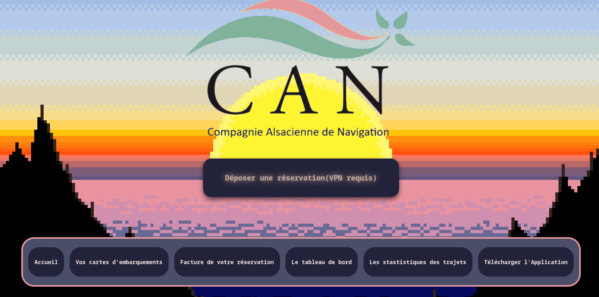
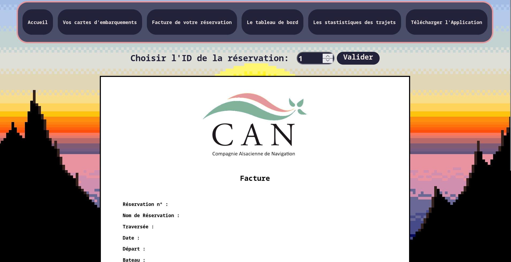

# Reservation Management System

**IMPORTANT NOTICE:** The backend API for this application no longer works. This was built as a school project, so the API and servers have been taken offline. You can still view the interface, but no actual data will be loaded or processed.

## Overview
This project is a web-based reservation and booking management system designed to process JSON data. It provides a comprehensive interface for handling bookings, generating invoices, viewing statistics, and managing tabular data. 

## Screenshots

## Features
- Dashboard and Statistics: Visual representation of reservation data and key metrics (stat.html).
- Invoice Generation: Billing overview and invoice rendering interface (facture.html).
- Data Management: Tabular (tableau.html) and card-based (cartes.html) views for navigating reservation records.
- Responsive Design: Modular CSS architecture specific to each component ensuring a maintainable codebase.

## Technology Stack
- Front-End: HTML5, CSS3, Vanilla JavaScript
- Back-End/Processing: C#
- Data Exchange: JSON

## Repository Structure
- /css: Contains all modular stylesheets.
- /scripts: Contains all JavaScript logic files for data handling and DOM manipulation.
- /program: Contains C# processing script(s).
- /img: Image assets and icons.
- /assets: Project screenshots.

## Setup and Installation
1. Clone the repository to your local environment.
2. Open the project root directory.
3. Serve the directory using a local web server (such as VS Code Live Server, Apache, or Python HTTP Server) to ensure proper execution of JavaScript modules and fetch requests. *(Note again: the API is down, so functionality is severely limited).*
4. Navigate to index.html in your preferred web browser.

## Usage
- Navigate through the application using the main index page.
- Use the data views to monitor incoming JSON reservation data.
- Generate and print formatted invoices directly from the invoice panel.
